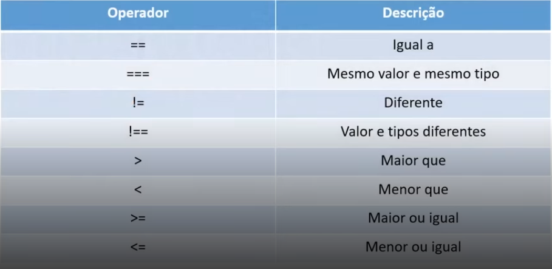
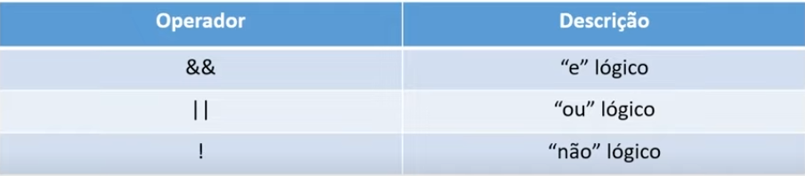
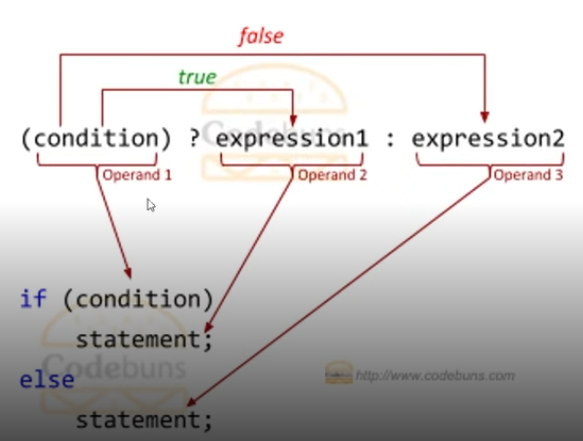

# Operators
## Operators are sings and symbols that we use to manipulate data/value in the variables.
<br>

<ol>
    <li>Aritimetic</li>
    <li>Assignment</li>
    <li>Logic</li> 
    <li>Conditional</li>
    <li>Comparison</li>
</ol>

---
<br>

# Assigment
## Operators for assign value to the variables


- ## = : means that the value assigned is the same as the variable equalized.
<br>

# And the others we use to assign value already doing a math operation.
- ## += : Is the same the same that ` x = x + y `
````
x = 5;
y = 2; 

x += y
console.log(x) //7 x = x + y 
````
- ## -= : Is the same the same that ` x = x - y `
````
x = 10;
y = 4; 

x -= y
console.log(x) //6 x = x - y 
````
- ## *= : Is the same the same that ` x = x * y `
````
x = 5;
y = 10; 

x *= y
console.log(x) //50 x = x * y 
````
- ## /= : Is the same the same that ` x = x / y `
````
x = 10;
y = 2; 

x /= y
console.log(x) //5 x = x / y 
````
- ## %= : And here the rest of the share operations is returned ` x = x % y `
````
x = 10;
y = 2; 

x %= y
console.log(x) //0 x = x % y 
````
----
<br>

# Aritimetic
## Operators that we use do to calculum/math operations.


- ## + : Add operations
````
x = 5;
b = 10;

c = x + b;
console.log(c); //15
````
- ## * : Multiply operations
````
x = 5;
b = 10;

c = x * b;
console.log(c); //50
````
- ## **  : Exponencial operations
````
x = 2;
b = 4;

c = x ** b;
console.log(c); //16  2x2x2x2=16
````
- ## / : Share operations
````
x = 25;
b = 5;

c = x / b;
console.log(c); //5
````

- ## % : rest of the share operation is returned ` x % y `
````
x = 10;
y = 2; 

x % y
console.log(x) //0 
````
- ## ++ : Add 1 `i++`
- ## -- : Decrease 1 `i--`
---
<br>

# Comparing
## The signs that we use to compare the variable values.


- ## == : Same value
````
if(x == b) {
    /////
}
````
- ## === : Same value and same type
````
if(x === b) {
    ////
}
````
- ## != : Value is diferent ? 
````
if(x != b) {
    ////
}
````
- ## !== : Value and type are diferent ? 
````
if(x !== b) {
    ////
}
````
- ## > : Bigger 
````
if(x > b) {
    ////
}
````
- ## < : Smaller 
````
if(x < b) {
    ////
}
````
- ## >= : Bigger or equal  
````
if(x >= b) {
    ////
}
````
- ## <= : Smaller or Equal 
````
if(x <= b) {
    ////
}
````
---
<br>

# Lógic
## Signs to apply logic inline without writting a function.

- ## && : AND 
- ## || : OR
- ## ! : NO! 
````
if(a&&b) {

}
if(!a) {

}

````
---
<br>

# Conditional
## Applying logic with a if/else inline


- ## 1- If `(mycondition) ? (myconditon2)` is true, is executed.
- ## if its not `:(expression3)` the else ":" is executed.
---