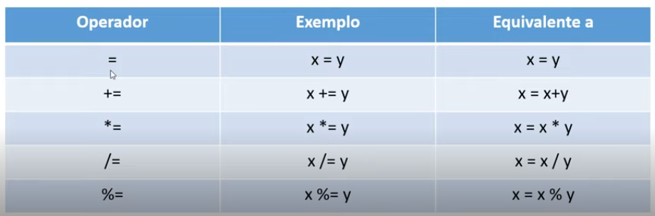
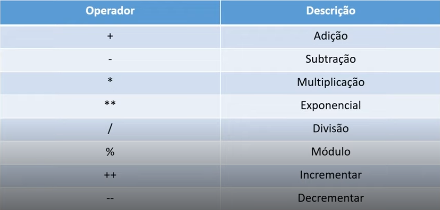

# Operators
## Operators are sings and symbols that we use to manipulate data/value in the variables.
<br>

<ol>
    <li>Aritimetic</li>
    <li>Assignment</li>
    <li>Logic</li> 
    <li>Conditional</li>
    <li>Comparison</li>
</ol>

---
<br>

# Assigment
## Operators for assign value to the variables



- ## = : means that the value assigned is the same as the variable equalized.
<br>

# And the others we use to assign value already doing a math operation.
- ## += : Is the same the same that ` x = x + y `
````
x = 5;
y = 2; 

x += y
console.log(x) //7 x = x + y 
````
- ## -= : Is the same the same that ` x = x - y `
````
x = 10;
y = 4; 

x -= y
console.log(x) //6 x = x - y 
````
- ## *= : Is the same the same that ` x = x * y `
````
x = 5;
y = 10; 

x *= y
console.log(x) //50 x = x * y 
````
- ## /= : Is the same the same that ` x = x / y `
````
x = 10;
y = 2; 

x /= y
console.log(x) //5 x = x / y 
````
- ## %= : And here the rest of the share operations is returned ` x = x % y `
````
x = 10;
y = 2; 

x %= y
console.log(x) //0 x = x % y 
````
----
<br>

# Aritimetic
## Operators that we use do to calculum/math operations.



- ## + : Add operations
````
x = 5;
b = 10;

c = x + b;
console.log(c); //15
````
- ## * : Multiply operations
````
x = 5;
b = 10;

c = x * b;
console.log(c); //50
````
- ## / : Share operations
````
x = 25;
b = 5;

c = x / b;
console.log(c); //5
````
